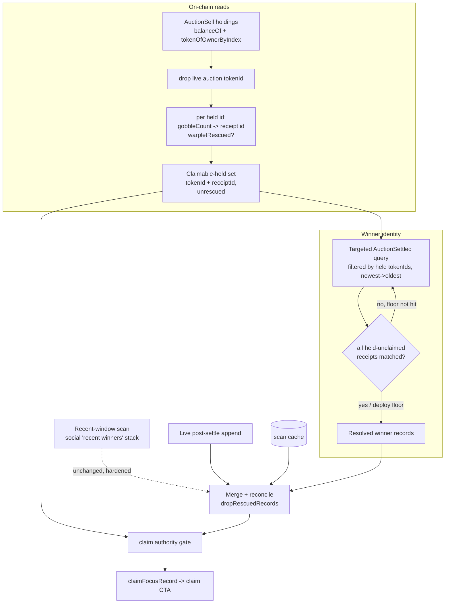

# fix: Surface claimable Warplets from on-chain holdings

## Summary

Make the auction-winner claim surface derive from authoritative on-chain state instead of a fragile, time-bounded `AuctionSettled` log scan. Enumerate the Warplets AuctionSell currently holds, keep those that are genuinely unclaimed (`warpletRescued == false`, not the live lot), and use that set as the source of truth for "what's claimable" — then resolve winner identity for exactly those lots via a targeted, age-independent log lookup. This closes the three reliability gaps found while debugging Mark Carey's "I settled but there's no claim button" report.

---

## Problem Frame

PR #44 fixed the immediate correctness bug (already-claimed lots hijacking the claim focus) by reconciling settlement records against on-chain `warpletRescued`. But the records themselves still come from a client-side scan of `AuctionSettled` logs that has three independent reliability gaps, all observed live against Base mainnet during that investigation:

- **Fixed lookback hides old wins.** The scan only covers `AUCTION_SETTLED_LOOKBACK_BLOCKS = 1_000_000n` (~23 days). Warplet `#901147` settled at block `44,731,673` — ~1.95M blocks back, below the floor — so its winner (`0xf8a0…cC71`) can't see or claim it in the UI even though it sits held and unrescued in the contract.
- **The scan discards everything on a single error.** In the backfill effect, `if (scanFailed && records.length === 0) return;` means one capped/flaky-RPC window error before any record is found persists nothing and surfaces no claim CTA — the most likely "no button at all" path on a mobile/mini-app RPC.
- **No completeness signal.** Even when the scan runs, nothing tells the UI whether it has found every currently-claimable lot. Records are trusted blindly and never cross-checked against what the contract actually still holds.

These are discoverability failures, not fund risk: unclaimed Warplets sit reserved to their winner indefinitely with no deadline and can always be claimed later (including directly via the contract). But a winner who can't find their claim in the app is a real product failure.

The fix inverts the data dependency: **current holdings + `warpletRescued` define what's claimable; logs only supply who won.**

---

## Requirements

### Discovery and resilience

- R1. A winner with a held, unrescued Warplet sees a claim CTA regardless of how long ago the auction settled — no lookback cliff.
- R2. A transient RPC failure during sourcing never zeroes the claim surface when claimable lots exist; whatever was resolved persists and displays, and sourcing resumes on the next load.

### Correctness

- R3. Only genuinely-claimable lots surface: held by AuctionSell, `warpletRescued == false`, and not the live auction lot. (Extends the #44 reconciliation.)
- R4. A surfaced claim carries the exact reserved receipt id (`gobbledTokenId = gobbleIndex * WARPLET_ID_PADDING + warpletId`) so the rescue transaction targets the right id for re-gobbled Warplets.

### Performance and compatibility

- R5. The added on-chain reads are bounded (a small multicall sized to current holdings) and don't regress page load; the first full resolve is cached for subsequent visits.
- R6. The existing "recent winners" social display and the live post-settle append path keep working; this change layers on top of them rather than replacing them.

---

## Key Technical Decisions

- KTD1. Holdings are the source of truth for "what's claimable." Enumerate AuctionSell's Warplet holdings via the Warplets ERC-721 (`balanceOf` + `tokenOfOwnerByIndex` — confirmed enumerable against mainnet), drop the live `auction().tokenId`, and for each remaining held id compute the latest receipt from `gobbleCount` and read `warpletRescued`. The unrescued remainder is the authoritative claimable set. Rationale: this is age-independent and resistant to log-scan failure — it reads what the contract holds right now.

- KTD2. Winner identity still requires logs, by targeted lookup. `_reservedRecipient` is `private` in `GobbledWarplets` with no getter, so the winner→Warplet mapping can only come from `AuctionSettled`. Resolve it for exactly the claimable-held set by querying `AuctionSettled` filtered on those `tokenId`s (indexed topic, OR-set), walking newest→oldest until every held-unclaimed receipt is matched, with the AuctionSell deploy block as a backstop floor. Rationale: a topic-filtered query returns only the few relevant logs, so it stays cheap and complete at any age — unlike the blind 1M-block sweep.

- KTD3. Two-track sourcing. Keep the existing bounded recent-window scan for the social "recent winners" stack (it wants recency, not completeness); add the holdings-targeted resolve (KTD2) for the claim surface. The viewer's claim is driven by the holdings-claimable set joined with resolved winners, the live-append record, and cache. Rationale: the two surfaces have different needs; conflating them is what made the claim path inherit the recent scan's lookback cliff.

- KTD4. Persist partial, never discard. Both tracks merge + persist + set state per completed window and keep prior results on a mid-scan error. Remove the `scanFailed && records.length === 0` discard. Rationale: directly fixes the "one window error → no records" failure.

- KTD5. Reuse existing primitives. Build on `mergeSettlementRecords` / `boundScanRecords` / the scan cache and the #44 `dropRescuedRecords` reconciliation rather than reworking the record model. Rationale: minimize churn; the holdings set and the reconciliation agree by construction (both keyed on `warpletRescued`).

---

## High-Level Technical Design

Two independent sources feed the claim surface; the holdings-claimable set is the authority and the completeness gate.

Persist + set state happen per completed window in both the recent scan and the targeted resolve, so a partial run still surfaces what it found (R2/KTD4).

---

## Implementation Units

### U1. Claimable-holdings reader

**Goal:** Produce the authoritative claimable-held set `{ warpletId, receiptId }` from current on-chain state.

**Requirements:** R3, R4, R5

**Dependencies:** none

**Files:**
- `web/src/lib/claimable-holdings.ts` (new) — pure helpers: compute receipt id from `warpletId` + `gobbleCount`, and decide claimability from `(gobbleCount, warpletRescued, liveAuctionTokenId)`.
- `web/src/lib/claimable-holdings.test.ts` (new)
- `web/src/components/GobblerAuctionSection.tsx` — wire the reads (`useReadContracts` for `balanceOf`/`tokenOfOwnerByIndex`, then `gobbleCount`/`warpletRescued`).

**Approach:** Read `balanceOf(AuctionSell)` on the Warplets collection, enumerate with `tokenOfOwnerByIndex`, drop the live `auction().tokenId`, then multicall `gobbleCount(id)` and `warpletRescued((gobbleCount-1)*padding + id)` for each. Keep ids whose latest receipt is unrescued. Keep the pure decision logic in the lib; the component owns the wagmi reads.

**Patterns to follow:** the #44 `useReadContracts` multicall in `GobblerAuctionSection.tsx` (including the `Boolean(r.result)` coercion for the widened result type); receipt-id encoding in `web/src/lib/gobbled-token-id.ts`; the `WARPLET_ID_PADDING` reads already present.

**Test scenarios:**
- Computes latest receipt id as `(gobbleCount - 1) * padding + warpletId` (e.g. `gobbleCount 2`, id `884860`, padding `1e8` → `100884860`). Covers R4.
- Excludes the live auction `tokenId` from the claimable set.
- Excludes ids whose latest receipt is `warpletRescued == true`.
- Keeps ids whose latest receipt is unrescued.
- `gobbleCount == 0` (held but never reserved — anomalous) is excluded and surfaced as a distinct signal, not treated as claimable.
- Empty holdings → empty set; no throw.

**Verification:** Against current mainnet state the reader returns `#901147` (receipt `901147`) and `#884860` (receipt `100884860`) as claimable and omits the live lot — matching the on-chain reads captured during the #44 investigation.

### U2. Holdings-targeted settlement resolver

**Goal:** Resolve winner identity for exactly the claimable-held set, age-independently, and know when the resolve is complete.

**Requirements:** R1, R4

**Dependencies:** U1

**Files:**
- `web/src/lib/log-scan.ts` — add a window generator that floors at a configurable deploy block (not a fixed lookback), and an "all-targets-matched" completeness predicate.
- `web/src/lib/log-scan.test.ts` — extend.
- `web/src/components/GobblerAuctionSection.tsx` — the targeted `getLogs` resolve, filtered by the claimable-held `tokenId`s.
- `web/src/lib/contracts.ts` and `web/.env.example` — `NEXT_PUBLIC_AUCTION_SELL_DEPLOY_BLOCK` backstop floor.

**Approach:** Query `AuctionSettled` filtered on the claimable-held `tokenId`s (indexed topic OR-set), walking newest→oldest. After each window, match returned logs to the claimable set by `gobbledTokenId` (and `winner`); stop as soon as every held-unclaimed receipt has a match, or at the deploy-block floor. Because the query is topic-filtered it returns only the handful of relevant logs, so windows can be wider than the social scan's 10k.

**Patterns to follow:** existing `computeLogScanWindows` and the newest→oldest walk in the current backfill effect; viem `getLogs` `args` topic-OR filtering; `getWinnerFingerprint` / `mergeSettlementRecords` for record shape.

**Test scenarios:**
- Window generator floors at the deploy block and never undershoots it.
- Completeness predicate returns true only when every target receipt is matched; false while any remain.
- An old in-set win (`#901147`-style, ~1.95M blocks back) is reached because the walk continues until matched, not stopped at a fixed lookback. Covers R1.
- Matching keys on `gobbledTokenId` so a re-gobbled Warplet resolves to the correct receipt, not an older gobble. Covers R4.
- Reaching the deploy floor with an unmatched target stops the walk and surfaces a diagnostic (does not loop to block 0).

**Verification:** With `#901147` in the holdings set, the resolver returns its `AuctionSettled` record (`winner 0xf8a0…`, receipt `901147`) even though it is far outside the old 1M window.

### U3. Non-aborting, incremental backfill (recent-winners scan)

**Goal:** A transient RPC error never zeroes the claim/recent surface; partial progress persists.

**Requirements:** R2, R6

**Dependencies:** none (independent of U1/U2; can land first)

**Files:**
- `web/src/components/GobblerAuctionSection.tsx` — the existing `AuctionSettled` backfill effect.
- `web/src/lib/settlement-records.ts` or a small new reducer module + test — extract the per-window merge/persist step as a pure function if it improves testability.

**Approach:** Move merge + `writeScanCache` + `setChainSettlementRecords` inside the window loop so each completed window commits incrementally. On a window error, break but keep everything already persisted — delete the `scanFailed && records.length === 0` discard. Re-check the effect's dependency churn observed during investigation (cancel/restart on re-mount) and stabilize deps so a slow scan can actually complete; if confirmed, that is the difference between "completes in ~40s" and "never persists."

**Execution note:** Start by characterizing the current discard/abort behavior with a test around the extracted reducer before changing it.

**Test scenarios:**
- A window error after N successful windows keeps the N windows' records (no discard).
- A first-window error persists nothing but does not throw and leaves any cache seed intact.
- Incremental commit dedupes against the cache seed (no duplicate records across windows).
- Test expectation for any non-extracted effect glue: none — covered by integration behavior in U4.

**Verification:** Simulated mid-scan failure (mock a throwing window) still yields the most recent winners; cache reflects partial progress.

### U4. Integrate holdings authority into the claim surface

**Goal:** Make the holdings-claimable set the claim authority and completeness gate, joined with resolved winners + cache + live-append, so a viewer's held-unclaimed lot is never hidden by incomplete log state.

**Requirements:** R1, R2, R3, R6

**Dependencies:** U1, U2, U3

**Files:**
- `web/src/components/GobblerAuctionSection.tsx` — combine the holdings-claimable set (U1) and resolved winners (U2) with `mergedSettlementRecords`; feed `sortedOpenSettlements` / `claimFocusRecord`; keep the #44 `dropRescuedRecords` reconciliation (now redundant-by-construction but retained as defense).
- `web/src/lib/claimable-holdings.ts` — a pure join helper (claimable set × resolved winners → claim records) with tests.

**Approach:** The viewer's claim records = resolved winners for claimable-held lots they won, unioned with cache/live-append, filtered to the claimable-held set. Drive the U2 resolve's stop condition from the holdings set. Optionally, when a held-unclaimed lot is the viewer's (winner identity confirmed from a cached/live record) but the targeted resolve is still in flight, the CTA can show immediately; pure holdings can't prove "yours" without a record, so this is a record-gated surface (see Open Questions).

**Test scenarios:**
- Join: a claimable-held lot with a resolved winner record for the viewer produces a claim record; one with no matching winner record produces none.
- A claimable-held lot whose winner is someone else does not surface for the viewer.
- A lot present in records but absent from the holdings-claimable set (already rescued elsewhere) does not surface — consistent with #44.
- Integration: with the live lot settled to the viewer and a stale higher-bid claimed lot present, the focus is the genuinely-unclaimed lot (the #44 regression stays fixed).

**Verification:** Reproduce the markcarey scenario from the #44 verification (mock viewer, nothing dismissed): the gate focuses the genuinely-unclaimed lot driven by holdings + resolved winner, and `#901147`'s winner sees its claim once resolved.

---

## Scope Boundaries

### In scope

- Holdings-driven claimable set, targeted winner resolve, incremental/non-aborting backfill, and integration into the existing claim CTA.

### Deferred to follow-up work

- Moving settlement sourcing to the `warplet-activity-indexer` (Ponder) and dropping the client-side scans entirely — the most robust long-term shape, but a larger project with an API + schema dependency.
- A global "AuctionSell holds N unclaimed Warplets" operator indicator / nudge to winners.
- Exposing the bare `rescueWarplet(uint256)` (variant 1) emergency path in the UI — intentionally hidden today.

### Outside this change

- Any contract change (the contracts are correct and immutable; `warpletRescued` keying is per-receipt and already verified).
- The #44 focus reconciliation against `warpletRescued` (already shipped and merged).
- Auction/settlement mechanics — auctions advance independently of claims; unclaimed lots persist with no deadline.

---

## Risks & Dependencies

- R1 (dep). Winner identity depends on `AuctionSettled` logs because `_reservedRecipient` has no getter. A logs-free claim surface is not achievable without a contract change; this plan does not pursue one.
- Topic-filtered `getLogs` over wide block ranges may still hit RPC range caps. Mitigation: windowed walk with the deploy-block floor; widen chunk size only as the filtered query allows.
- Warplets collection must remain ERC-721 enumerable for `tokenOfOwnerByIndex`. Confirmed against mainnet during investigation; low risk, but the reader should degrade gracefully (fall back to log-only sourcing) if enumeration ever reverts.
- First full resolve for a brand-new cache can be the slowest path. Mitigation: it is bounded by the oldest unclaimed holding (not the chain), cached after the first run, and displays progressively (R2/KTD4).
- Deploy-block backstop must be set for the floor to be meaningful (`NEXT_PUBLIC_AUCTION_SELL_DEPLOY_BLOCK`).

---

## Open Questions

- Deploy-block source: env var (consistent with how addresses are configured in `web/src/lib/contracts.ts`) vs. a checked-in constant vs. deriving it once. Lean env var; resolve at implementation.
- Whether to show a holdings-only "you have an unclaimed Warplet — resolving details…" affordance while the targeted resolve is in flight. Pure holdings can't prove a lot is *yours* without a winner record, so the default is a record-gated CTA; the affordance is an optional UX nicety, deferred unless trivial.

---

## Sources & Research

- Claim-surfacing pipeline and the fixed lookback: `web/src/components/GobblerAuctionSection.tsx` (backfill effect; `AUCTION_SETTLED_LOOKBACK_BLOCKS`, the `scanFailed && records.length === 0` discard, `claimFocusRecord`).
- Window generation: `web/src/lib/log-scan.ts`; cache: `web/src/lib/settlement-cache.ts`; record model + merge: `web/src/lib/settlement-records.ts`.
- #44 reconciliation this builds on: `web/src/lib/claimable-records.ts`, `web/src/hooks/useGobbledRescue.ts`, `web/src/lib/gobbled-token-id.ts`.
- Receipt-id encoding and `warpletRescued` semantics: `contracts/src/GobbledWarplets.sol` (`reserve`, `rescueWarplet`, `WARPLET_ID_PADDING`); test `contracts/test/GobbledWarplets.t.sol::test_second_gobble_increments_index_and_tokenId`.
- Live mainnet evidence (from the #44 investigation): AuctionSell `0x2d890277…928dc` holdings vs. queue; `#901147` settled at block `44,731,673` (winner `0xf8a0…cC71`, receipt `901147`, unrescued) — below the 1M lookback floor `45,679,379`; `#884860` re-gobbled with receipt `100884860` unrescued.
