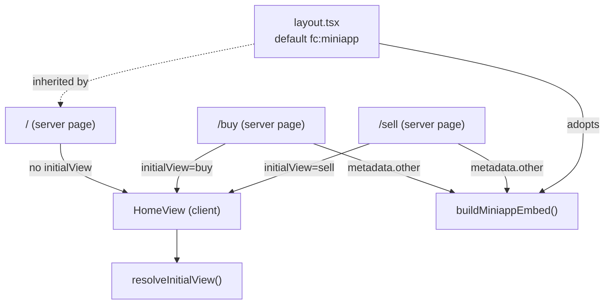
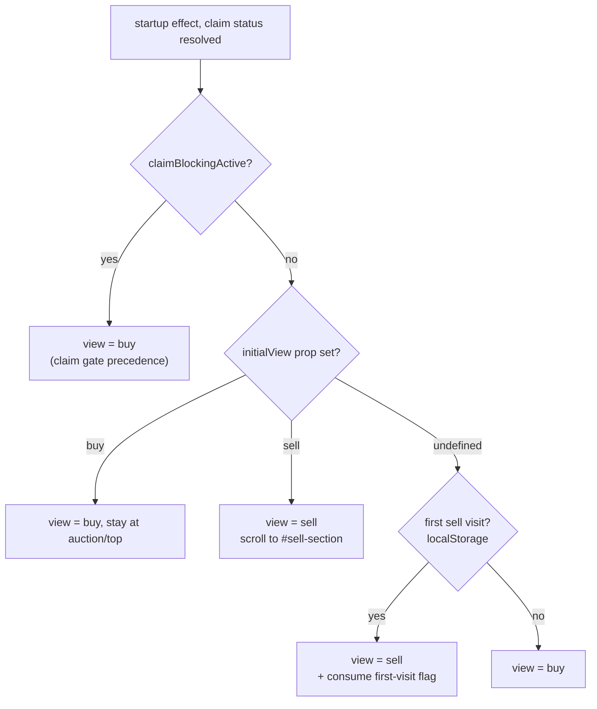

# feat: Buy and Sell landing routes with per-route Farcaster embeds

## Summary

Add `/buy` and `/sell` routes that each open the mini app straight to the matching screen and serve their own Farcaster mini-app embed (own preview image + launch target), so a shared `/sell` link previews and opens as "sell" and `/buy` as "bid." The existing `/` route keeps today's scroll-driven behavior. The sell preview image is an external dependency; the code ships against a placeholder until it exists.

---

## Problem Frame

Marketing splits into two stories — "sell your Warplet to the Gobbler" and "bid on the current Warplet" — but every mini-app link resolves to the single `/` route, whose Farcaster embed always previews and opens to the bid/auction screen. People arriving from a "sell" message land in the wrong context. There is no URL today that a "sell"-themed cast can point at.

The app already has the raw materials: `web/src/app/page.tsx` holds an `activeView` (`"buy" | "sell"`) state and a `FIRST_SELL_VISIT_KEY` localStorage mechanism that already defaults first-time visitors to the sell view. What's missing is (a) a way to drive that initial view from the URL instead of localStorage, and (b) per-route Farcaster embed metadata. Both are standard Next.js App Router patterns; the embed metadata API is already used in `web/src/app/layout.tsx`.

---

## Requirements

### Routing & view defaulting

- R1. `/buy` opens the app with the bid/auction screen as the initial view.
- R2. `/sell` opens the app with the sell screen as the initial view (scrolled to the sell section).
- R3. `/` (root) preserves today's behavior, including the existing first-sell-visit localStorage default.
- R4. The claim-blocking gate retains precedence over the route's initial view — a user with a gobbled token to claim still sees the claim/auction gate, even on `/sell`.

### Farcaster embeds

- R5. `/buy` serves a `fc:miniapp` embed whose launch action targets `…/buy`.
- R6. `/sell` serves a `fc:miniapp` embed whose launch action targets `…/sell` and uses a sell-specific preview image.
- R7. `/`'s existing embed (auction preview image, root launch URL) is byte-for-byte unchanged.

### Quality

- R8. No regression to the boot overlay, scroll-blend background, desktop corner toggle, or mobile bottom nav on any route.

---

## Key Technical Decisions

- KTD1 — **Extract the page's client component into a shared `HomeView` that accepts an `initialView` prop; convert each route to a thin server component that renders it.** Client components cannot export `metadata`, and per-route embeds require it. Sharing one client component avoids duplicating the entire app UI per route (see "Route → component → embed topology" under High-Level Technical Design for why all three routes render the same component).

- KTD2 — **Keep the default embed in `layout.tsx`; override per-route via each page's `metadata.other`.** Next.js (14.2.x) shallow-merges `metadata.other` per key (`Object.assign(target.other, source.other)`). Because the layout default and each page use the same key `fc:miniapp` whose value is one opaque JSON string, the child page's value overwrites the layout's at that key, yielding exactly one tag — so each page's `fc:miniapp` value must be the **full** blob, not a diff. Note the merge is additive across *different* keys: any non-`fc:miniapp` key added to the layout's `other` would be inherited by every route. To keep the three copies (layout default, `/buy`, `/sell`) from drifting, extract a `buildMiniappEmbed({ imageUrl, launchUrl })` helper into `web/src/lib/` and have it own the canonical `appUrl` definition (currently module-local in `layout.tsx`). Root `/` has no page-level `metadata`, so it inherits the layout default unchanged (satisfies R7).

- KTD3 — **Model the initial-view decision as a pure `resolveInitialView` function in `web/src/lib/`, wired into the existing startup effect.** The precedence logic is branchy (claim-blocking gate > route > first-visit > default); extracting it makes it unit-testable in the repo's established `lib/`-tested style and keeps the effect thin. Components and routes themselves stay untested per repo convention.

- KTD4 — **Ship `/sell` against a placeholder preview image; swap in the real sell asset when produced.** The embed image is hosted off-repo on the external image service (`api.warpletgobbler.xyz`), not in this codebase. Code should not block on an asset another system owns.

- KTD5 — **`/buy` and `/sell` are distinct landing URLs; `/` keeps scroll-driven view — no URL-rewrite-on-scroll.** Matches the marketing goal directly; syncing the URL to scroll position across sections adds complexity for little gain. (Confirmed scope decision.)

---

## High-Level Technical Design

### Route → component → embed topology

All three routes render one shared client component; each route owns its embed metadata.



### Initial-view resolution (runs in HomeView's startup effect)



`resolveInitialView` is the pure decision (returns the target view + a `source` discriminator); the effect performs the side effects (scroll, set `initialViewResolved`, consume the first-visit flag only when `source === "firstVisit"`).

---

## Implementation Units

### U1. Extract `HomeView` shared client component

**Goal:** Move the `Home` client component and its page-local helpers into a new `web/src/components/HomeView.tsx` (`"use client"`). Convert `web/src/app/page.tsx` into a server component that renders `<HomeView />`. Pure refactor — no behavior change, no `initialView` prop yet.

**Requirements:** Enables R1, R2; preserves R3, R8.

**Dependencies:** none.

**Files:**
- `web/src/components/HomeView.tsx` (new — holds `Home` renamed to `HomeView`, plus `MorphingSilhouettes`, `MiniAppWalletButton`, `GobblerBootOverlay`, `CaFooter`, and the module constants `MORPH_SHAPES`, `FIRST_SELL_VISIT_KEY`, `FOOTER_CA`, `lerpPath`)
- `web/src/app/page.tsx` (modify — drop `"use client"`; becomes `export default function Page() { return <HomeView />; }`)

**Approach:** Straight lift-and-shift. `Providers` stays in `layout.tsx` and continues to wrap all routes, so `HomeView` renders inside the existing wagmi/ConnectKit/QueryClient context on every route. Keep all imports pointing at the same `@/` paths. The default export of `HomeView.tsx` is the component; `page.tsx` imports it. No signature change beyond the rename.

**Patterns to follow:** Existing one-component-per-file convention in `web/src/components/`. Server-page-renders-client-component is the standard App Router split.

**Test scenarios:** `Test expectation: none — pure refactor with no logic change.` Verified via typecheck + lint + preview that `/` renders and behaves identically (boot overlay, scroll blend, toggle, mobile nav).

**Verification:** `pnpm typecheck` and `pnpm lint` pass; `/` in preview is visually and behaviorally identical to before the refactor.

---

### U2. Drive initial view from an `initialView` prop via a pure resolver

**Goal:** Add `initialView?: "buy" | "sell"` to `HomeView`. Introduce `resolveInitialView` in `web/src/lib/` and wire it into the existing startup effect so the prop overrides the localStorage default, with the claim-blocking gate retaining precedence.

**Requirements:** R1, R2, R3, R4.

**Dependencies:** U1.

**Files:**
- `web/src/lib/resolve-initial-view.ts` (new — pure function)
- `web/src/lib/resolve-initial-view.test.ts` (new — vitest)
- `web/src/components/HomeView.tsx` (modify — accept prop; call resolver in the "resolve startup target" effect that currently lives around the `FIRST_SELL_VISIT_KEY` logic)

**Approach:** The resolver takes `{ routeInitialView, claimBlockingActive, isFirstSellVisit }` and returns `{ view: "buy" | "sell", source: "claim" | "route" | "firstVisit" | "default" }`. Precedence: claim gate → route prop → first-sell-visit → buy default (see HTD flowchart). The startup effect maps the result to existing side effects: when the resolved `view === "sell"`, scroll to `#sell-section` with `behavior: "auto"` (an instant jump covered by the boot overlay — `smooth` stays reserved for user-initiated `toggleView`) and set `scrollBlend(1)`; only `source === "firstVisit"` additionally consumes `FIRST_SELL_VISIT_KEY` (an explicit `route` view does **not**, so a `/sell` visit doesn't silently change `/`'s future default). All scroll/blend side effects stay gated behind `setInitialViewResolved(true)` so the boot overlay's jaws don't open before the page has settled.

**Second-effect interplay (resolve at implementation):** the existing scroll-blend effect is *not* a passive listener — on mount it calls `compute()` synchronously, reads scroll position, and can call `setActiveView` via hysteresis. On `/sell`, that mount-time `compute()` runs while the page is still at scroll-top (the route scroll lands a frame later inside a `requestAnimationFrame` retry), so it can clobber the resolved view back to `"buy"`. The route view must survive this — handle it one of two ways: (a) gate the second effect's initial `compute()` until `initialViewResolved` is true and the route scroll has settled, or (b) seed `viewHintScrollRef.current` from the `route` source so the hysteresis starts from the correct anchor. The "claim-gate force-to-buy" early-return in the second effect only covers the claim-blocking branch, not the route branch.

**Technical design (directional, not implementation spec):**
```
resolveInitialView({ routeInitialView, claimBlockingActive, isFirstSellVisit }):
  if claimBlockingActive: return { view: "buy", source: "claim" }
  if routeInitialView:    return { view: routeInitialView, source: "route" }
  if isFirstSellVisit:    return { view: "sell", source: "firstVisit" }
  return { view: "buy", source: "default" }
```

**Patterns to follow:** Pure-logic-in-`lib/`-with-vitest, mirroring `web/src/lib/settlement-cache.test.ts` (uses a `fakeStorage()` helper, `describe/it/expect` from vitest).

**Test scenarios** (`web/src/lib/resolve-initial-view.test.ts`):
- Covers R1. route `"buy"`, returning visitor, not claim-blocking → `{ view: "buy", source: "route" }`.
- Covers R2. route `"sell"`, returning visitor → `{ view: "sell", source: "route" }` (overrides the returning-visitor buy default).
- Covers R3. route `undefined`, first visit → `{ view: "sell", source: "firstVisit" }` (preserves existing behavior).
- Covers R3. route `undefined`, returning visitor → `{ view: "buy", source: "default" }`.
- Covers R4. claim-blocking active + route `"sell"` → `{ view: "buy", source: "claim" }` (claim precedence).
- Edge: claim-blocking active + route `undefined` + first visit → `{ view: "buy", source: "claim" }` (claim still wins).

**Verification:** vitest green for the resolver; in preview, `/buy` lands on the auction view, `/sell` lands scrolled to the sell section, `/` still auto-sends a first-time visitor to sell and a returning visitor to buy; a claim-eligible wallet sees the claim gate on all three routes.

---

### U3. Embed-builder helper + `/buy` route

**Goal:** Extract `buildMiniappEmbed` into `web/src/lib/`, adopt it in `layout.tsx` for the default embed (no output change), and add the `/buy` route that renders `<HomeView initialView="buy" />` with its own buy embed.

**Requirements:** R5, R7.

**Dependencies:** U1, U2.

**Files:**
- `web/src/lib/miniapp-embed.ts` (new — `buildMiniappEmbed({ imageUrl, launchUrl })` returns the `fc:miniapp` object; an `appUrl` export or shared constant for the base URL)
- `web/src/lib/miniapp-embed.test.ts` (new — vitest)
- `web/src/app/layout.tsx` (modify — replace the inline `fc:miniapp` object with `buildMiniappEmbed(...)`; import `appUrl` from the helper instead of defining it locally; output must be identical)
- `web/src/app/buy/page.tsx` (new — server component; `export const metadata` with `other: { "fc:miniapp": JSON.stringify(buildMiniappEmbed({ imageUrl: <buy image>, launchUrl: `${appUrl}/buy` })) }`; renders `<HomeView initialView="buy" />`)

**Approach:** The buy preview image is the existing auction image (the buy/bid screen), so `/buy`'s embed can reuse the current auction image URL with a `…/buy` launch target. `layout.tsx` keeps providing the default embed for `/` (R7) — adopting the helper there is a behavior-preserving refactor guarded by the regression test below. Per KTD2, `/buy`'s `metadata.other` carries the **full** blob (override is wholesale).

**Patterns to follow:** `web/src/app/layout.tsx` current `metadata.other["fc:miniapp"]` shape; `appUrl` fallback pattern (`process.env.NEXT_PUBLIC_APP_URL || "https://warpletgobbler.xyz"`).

**Test scenarios** (`web/src/lib/miniapp-embed.test.ts`):
- Covers R7. `buildMiniappEmbed({ imageUrl: <auction>, launchUrl: <root> })` deep-equals the current hardcoded layout embed object — including the `splashImageUrl`, `name`, and `splashBackgroundColor` sub-fields (regression guard against the layout refactor).
- Covers R5. `buildMiniappEmbed({ imageUrl, launchUrl: `${appUrl}/buy` })` deep-equals an expected `/buy` blob — `version: "1"`, the buy `imageUrl`, `button.action.type === "launch_miniapp"`, `button.action.url` ending `/buy`, and the splash sub-fields carried through unchanged (guards against the helper dropping fields its `{ imageUrl, launchUrl }` signature doesn't take).

**Verification:** vitest green; `/buy` page source (`view-source` / Farcaster embed debugger) shows a valid `fc:miniapp` meta tag with the `/buy` launch URL; `/` embed unchanged; typecheck + lint pass.

---

### U4. `/sell` route + placeholder sell image

**Goal:** Add the `/sell` route rendering `<HomeView initialView="sell" />` with a sell-specific embed, using a placeholder preview image until the real sell asset is hosted.

**Requirements:** R6.

**Dependencies:** U1, U2, U3.

**Files:**
- `web/src/app/sell/page.tsx` (new — server component; `metadata.other["fc:miniapp"]` = `buildMiniappEmbed({ imageUrl: <sell image, placeholder for now>, launchUrl: `${appUrl}/sell` })`; renders `<HomeView initialView="sell" />`)

**Approach:** Reuses the `buildMiniappEmbed` helper from U3. The `imageUrl` points at the intended external path (e.g., `…/frimg/mini/sell.png`) with a clear placeholder marker; until that asset exists, fall back to the auction image so the embed never 404s its preview. Leave a code comment noting the asset swap is pending (tracked in Scope Boundaries → external dependency).

**Patterns to follow:** Mirror `web/src/app/buy/page.tsx` from U3 exactly, changing only the image and launch URL.

**Test scenarios:** `Test expectation: none — reuses the U3-tested helper with different inputs; no new logic.` Verified via Farcaster embed validation + preview.

**Verification:** `/sell` in preview lands scrolled to the sell section (R2 path from U2); page source shows a valid `fc:miniapp` with the `/sell` launch URL; embed preview renders (placeholder image acceptable until the real asset lands).

---

## Scope Boundaries

### In scope
- Three routes (`/`, `/buy`, `/sell`) sharing one client component, with per-route initial view and per-route Farcaster embed metadata.

### Deferred to Follow-Up Work
- **Sell preview image (external dependency):** the real sell-themed embed image must be produced and hosted on the external image service (`api.warpletgobbler.xyz/api/gobbler/frimg/mini/…`). This repo ships a placeholder; swapping the URL is a one-line follow-up once the asset exists. **Rollout caveat:** while the placeholder is the auction image, a shared `/sell` link previews with the *bid* image — the exact wrong-context this plan fixes for *opening* but not yet for *previewing*. Do not promote `/sell` in marketing until the real asset lands, or use a cheap sell-distinct interim image (e.g. a recolored/text-overlaid placeholder) rather than the auction image.
- Updating `CLAUDE.md`'s App Router notes to mention the new routes (docs touch, optional).

### Out of scope (non-goals)
- URL-rewrite-on-scroll (syncing the address bar to scroll position between sections) — see KTD5.
- A `/stake` route — StratStaking has no UI section yet (consistent with the mobile-bottom-nav scope).
- Changes to the Farcaster mini-app manifest (`.well-known/farcaster.json`); embeds are per-page meta tags and don't require manifest edits.
- Any change to section content, the gobble/buy overlays, or the auction/sell mechanics.

---

## System-Wide Impact

- **External contract surface (Farcaster crawler):** the `fc:miniapp` meta tags are read by Farcaster clients to render share previews and the launch button. Adding routes adds new embed surfaces; a malformed embed yields a broken preview. The `buildMiniappEmbed` helper + the R7 regression test (deep-equal against today's blob) guard the existing `/` embed; new routes should be validated with the Farcaster embed debugger before sharing.
- **Launch URL correctness:** embeds depend on `NEXT_PUBLIC_APP_URL` (fallback `https://warpletgobbler.xyz`). A misconfigured env would point launch buttons at the wrong origin — an existing risk, unchanged in shape but now spread across three routes.

---

## Open Questions

- **Post-claim behavior on `/sell` (R4).** When a claim-eligible wallet opens `/sell`, the claim-blocking gate wins and shows the auction/claim screen. After they complete the claim and `claimBlockingActive` flips false, should they be routed to the **sell** view (honoring their original `/sell` intent), or left on buy? The resolver currently has no memory of the route intent across the claim transition. Recommendation: carry `initialView` through and resolve to sell once the claim clears; optionally a one-line in-gate note ("complete your pending claim first, then you can sell"). Decide before U2.
- **Per-route embed copy.** The current embed uses `button.title: "Launch"` and `action.name: "WarpletGobbler"` for all routes. Should `/buy` and `/sell` carry distinct copy (e.g. a "sell"-flavored button/name) or stay uniform? If distinct, `buildMiniappEmbed` needs those as parameters; if uniform, state it so U4's "mirror `/buy` exactly" is unambiguous.
- **Claim-resolution timing on new routes (minor).** The boot overlay stays up until `claimBlockingResolved` (an on-chain read). `/buy` and `/sell` inherit this gating unchanged — confirm the existing read has an adequate timeout so a slow RPC doesn't leave a new route black-screened, or accept the inherited behavior explicitly.

---

## Risks & Dependencies

- **Embed field drift on extraction (KTD2)** — the real risk is *not* "two competing tags" (the per-key `Object.assign` merge collapses same-key entries to a single tag, so that failure cannot occur with the shared `fc:miniapp` key), but that extracting `buildMiniappEmbed` silently drops or hardcodes the embed's sub-fields (`splashImageUrl`, `name`, `splashBackgroundColor`) that its `{ imageUrl, launchUrl }` signature doesn't take. Mitigation: the U3 regression test deep-equals the **full** generated blob (not a spot-check) against today's embed, and verify the rendered `<head>` on each route shows exactly one `fc:miniapp` tag with the right launch URL. Also watch `NEXT_PUBLIC_APP_URL` at build time — if unset, `launchUrl` falls back to `https://warpletgobbler.xyz`.
- **Placeholder image (KTD4)** — `/sell`'s preview is a placeholder until the external asset exists; the route is shippable but its share preview is not final.
- **Startup-effect interplay (U2)** — the boot overlay (`initialViewResolved` gating), scroll-blend hysteresis (`viewHintScrollRef`), and claim-blocking gate all touch the same startup window. The resolver isolates the *decision*, but the *side effects* (scroll, flag consumption) need preview testing on all three routes, especially the claim-eligible-wallet case.

---

## Sources / Research

- `web/src/app/layout.tsx` — current single `fc:miniapp` embed (auction image, root launch); the pattern `/buy` and `/sell` extend.
- `web/src/app/page.tsx` — `activeView` state, `FIRST_SELL_VISIT_KEY` startup effect, `toggleView`, `#auction` / `#sell-section` anchors; the view-resolution logic U2 refactors.
- `web/src/hooks/useMiniApp.ts` — mini-app SDK init/`ready()`; confirms routing works inside the Farcaster host.
- `web/src/lib/settlement-cache.test.ts` — vitest + `fakeStorage()` convention the new `lib/` tests mirror.
- `docs/brainstorms/2026-04-30-mobile-bottom-nav-requirements.md` — adjacent buy/sell view-switching context (`activeView`, section anchors, gating conditions).
- Next.js App Router metadata API (per-route `metadata` export, `metadata.other`) — established framework pattern; no external research dispatched (strong local precedent in `layout.tsx`).
