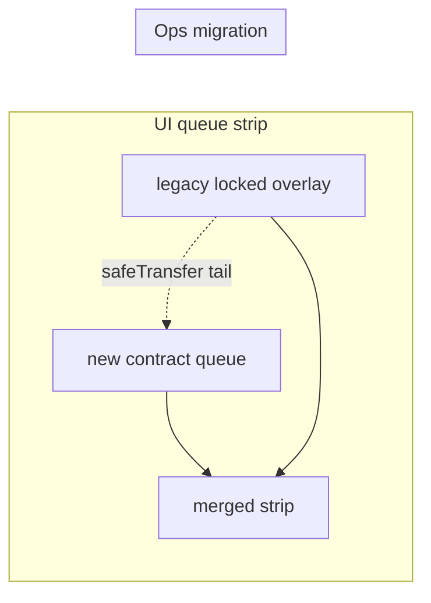

# WarpletGobbler full redeploy migration plan

**Status:** draft for review  
**Date:** 2026-06-16  
**Strategy:** redeploy immutable contracts → cut over UI immediately → drain old `AuctionSell` queue via operator bids → re-enqueue rescued Warplets on the new stack

---

## Summary

The live `AuctionSell` was deployed with `stremeZap = address(0)`, so ETH bids always revert. `stremeZap`, `gobbledWarplets`, and `nftReserve` are immutable on the deployed contracts, so the fix is a **fresh deploy** of the auction stack and a **new Gobbler** wired through the existing `FeeHandler`.

This plan follows the three steps you approved:

1. **Redeploy everything** (new `GobbledWarplets` + `AuctionSell` + `DutchAuctionV2`; keep `FeeHandler`, `$WARPGOBB`, and staking)
2. **Switch the UI immediately** to the new addresses
3. **Buy through the old queue** on the legacy contract (ops-only), rescue Warplets, and `safeTransfer` them to the **tail** of the new queue over time — while the UI **shows legacy locked Warplets in the queue strip** until they land on-chain

---

## Why migrate

| Issue | Live contract | New deploy |
|-------|---------------|------------|
| ETH bidding | `stremeZap()` = `0x0` | Set `AUCTION_SELL_STREME_ZAP` to `0xEe3f62CF6987121f9cBe567C0E5a01c940A7e570` (same zap `FeeHandler` uses) |
| `setDuration` | Not on deployed bytecode | Included in current `AuctionSell.sol` |
| Gobbler → queue routing | `DutchAuctionV2.nftReserve` is immutable | New Gobbler points at new `AuctionSell` |

`FeeHandler` does **not** need redeployment — `setAuction` + `startStream` repoints the stream. `GobbleSniper` only needs redeploy if you actively use it (it hardcodes the Gobbler address).

---

## Current on-chain snapshot (Base mainnet)

Verified 2026-06-16:

| Contract | Address |
|----------|---------|
| **AuctionSell** (live) | `0xa1046076E518B3Fe1604B2F19ABE90c55c252fd9` |
| **GobbledWarplets** (live) | `0x2159d7AAfA7CC6cBFf49B1ab9BD353c7e0d1d10b` |
| **DutchAuctionV2** (live) | `0x6B2A584369B2E81269618921C3b0033581819e39` |
| **FeeHandler** (keep) | `0x31aaf0B92Bac3ce9336FA1494A1405c24Cb449E4` |
| **$WARPGOBB** (keep) | `0x1A339C38Ae22726F1A4235bCecf8f12aebE4C5E8` |
| **StremeZap** (reuse) | `0xEe3f62CF6987121f9cBe567C0E5a01c940A7e570` |
| **Warplets** | `0x699727f9e01a822efdcf7333073f0461e5914b4e` |

**Live `AuctionSell` state:**

| Field | Value |
|-------|-------|
| Paused | `false` |
| Warplets held | **5** |
| Active auction | token `#987458` — high bid **111.1M** $WARPGOBB, bidder `0x3516006709B775e01B48dfB5FAd355a4E793E347`, ends block-time `1781712307` |
| Queue (`getQueuedTokenIds`) | `#249800`, `#421769`, `#266221`, `#420499` (**4** waiting) |
| `reservePrice` | 6.9M $WARPGOBB |
| `duration` | 86,400 s (24 h) |
| `stremeZap` | `0x0` |

**Implication:** five Warplets are trapped in the old contract until they are auctioned → settled → rescued. There is **no owner sweep**. Queue migration = run the old auction mechanics (operator-driven), not a bulk transfer.

---

## Scope

### Redeploy (new addresses)

| Contract | Script | Notes |
|----------|--------|-------|
| `GobbledWarplets` | `DeployAuctionSell.s.sol` | Deployed atomically with `AuctionSell` |
| `AuctionSell` | `DeployAuctionSell.s.sol` | Deploys **paused**; set `AUCTION_SELL_STREME_ZAP` |
| `DutchAuctionV2` | `DeployDutchAuction.s.sol` *or* `MigrateToNewDutchAuctionV2.s.sol` | `nftReserve` = **new** `AuctionSell` |
| `GobbleSniper` | `DeployGobbleSniper.s.sol` | **Redeploy required** — old sniper `0x83a6F4a4F94CAFBAb0E6a4992EFEDc05C0774D5d` exists on Base but points at DutchAuction **V1** (`0xD359…`), not the live V2 Gobbler |

### Keep (same addresses)

| Contract | Why |
|----------|-----|
| `FeeHandler` | `auction` is mutable; zap/LP wiring already correct |
| `$WARPGOBB` SuperToken | Stream token; no change |
| Staking (`proceedsRecipient`) | External streme.fun contract |
| Warplets ERC-721 | Collection unchanged |

### Retire later (legacy, do not abandon until drained)

| Contract | Role after cutover |
|----------|-------------------|
| `0xa104…` AuctionSell | Operator-only queue drain; no public UI bidding |
| `0x2159…` GobbledWarplets | Legacy `rescueWarplet` for winners who settled before cutover |

---

## Pre-deploy code (before Phase 1)

Ship these on the deploy branch **before** broadcasting:

### `GobbledWarplets` — legacy winner receipt

- Owner calls `adminMint(to, warpletId, uri)` manually for migration winners (no on-chain claim path).
- Constructor takes `LEGACY_AUCTION_SELL_ADDRESS` + `LEGACY_GOBBLED_WARPLETS_ADDRESS`.

### UI — unified queue strip (implemented)

Merge **new** on-chain queue + **legacy locked** Warplets into a single displayed queue. Locked tiles are non-bumpable.

---

## Pre-flight checklist

- [ ] `forge build` passes on the commit you intend to deploy
- [x] `adminMint` on new `GobbledWarplets` (owner-only, manual migration)
- [ ] `contracts/.env` has deploy key, `BASE_RPC_URL`, `BASESCAN_API_KEY`, and all deploy vars filled
- [ ] Confirm `GOBBLED_WARPLETS_TOKEN_URI_SETTER` / `GOBBLED_TOKEN_URI_SETTER_PRIVATE_KEY` alignment (mint API signs for `tokenURISetter`)
- [ ] Operator wallet holds enough $WARPGOBB to win ~5 auctions at reserve (≥ ~35M + current high bid on `#987458` if you must outbid)
- [ ] Decide multisig timing: deploy as EOA → `RotateAdminToMultisig.s.sol`, or deploy with `AUCTION_SELL_OWNER` / `ADMIN_ADDRESS` = multisig from the start
- [ ] Snapshot legacy addresses + deploy blocks for UI / indexer
- [ ] Communicate cutover window (Telegram, site banner) — **new gobbles go to the new queue only after Gobbler repoint**

---

## Phase 1 — Deploy new contracts

Run from `contracts/` with `--rpc-url base --broadcast --verify -vvv`.

### Step 1.1 — `GobbledWarplets` + `AuctionSell`

```bash
forge script script/DeployAuctionSell.s.sol:DeployAuctionSell \
  --rpc-url base --broadcast --verify -vvv
```

**Required env** (see `contracts/.env.example`):

```
WARPLETS_NFT_ADDRESS=0x699727f9e01a822efdcf7333073f0461e5914b4e
AUCTION_SELL_BID_TOKEN_ADDRESS=0x1A339C38Ae22726F1A4235bCecf8f12aebE4C5E8
AUCTION_SELL_PROCEEDS_RECIPIENT=<staking address>
AUCTION_SELL_OWNER=<EOA or multisig>
AUCTION_RESERVE_PRICE_WEI=6900000000000000000000000
AUCTION_TIME_BUFFER_SECONDS=<same as live or tuned>
AUCTION_MIN_BID_INCREMENT_PERCENT=<same as live>
AUCTION_DURATION_SECONDS=86400
AUCTION_SELL_STREME_ZAP=0xEe3f62CF6987121f9cBe567C0E5a01c940A7e570
GOBBLED_WARPLETS_NAME=...
GOBBLED_WARPLETS_SYMBOL=...
GOBBLED_WARPLETS_TOKEN_URI_SETTER=<signer for mint API>
```

**Record:** `NEW_AUCTION_SELL`, `NEW_GOBBLED_WARPLETS`, deploy block.

Script calls `gobbled.setMinter(newAuctionSell)` automatically. Auction starts **paused**.

### Step 1.2 — `DutchAuctionV2` + repoint `FeeHandler`

Option A — atomic (recommended):

```bash
# Set DUTCH_AUCTION_NFT_RESERVE_ADDRESS=NEW_AUCTION_SELL, FEE_HANDLER_ADDRESS=0x31aaf0...
forge script script/MigrateToNewDutchAuctionV2.s.sol:MigrateToNewDutchAuctionV2 \
  --rpc-url base --broadcast --verify -vvv
```

Option B — deploy Gobbler only, then manual admin txs:

```bash
forge script script/DeployDutchAuction.s.sol:DeployDutchAuction \
  --rpc-url base --broadcast --verify -vvv
# Then as FeeHandler admin:
#   feeHandler.setAuction(newGobbler)
#   feeHandler.startStream()
```

**Env for Gobbler:**

```
WARPLETS_NFT_ADDRESS=0x699727f9e01a822efdcf7333073f0461e5914b4e
DUTCH_AUCTION_PAYMENT_TOKEN_ADDRESS=0x1A339C38Ae22726F1A4235bCecf8f12aebE4C5E8
DUTCH_AUCTION_NFT_RESERVE_ADDRESS=<NEW_AUCTION_SELL>
FEE_HANDLER_ADDRESS=0x31aaf0B92Bac3ce9336FA1494A1405c24Cb449E4
```

**Record:** `NEW_DUTCH_AUCTION_V2`.

`setAuction` stops the stream to the old Gobbler, pulls stray $WARPGOBB balance from the old Gobbler into `FeeHandler`, and sets `streamActive = false` until `startStream()` (Migrate script calls both).

### Step 1.3 — Unpause new `AuctionSell`

```bash
AUCTION_SELL_ADDRESS=<NEW_AUCTION_SELL> \
forge script script/AuctionSellUnpause.s.sol:AuctionSellUnpause \
  --rpc-url base --broadcast -vvv
```

`unpause()` auto-starts the first auction **if** the queue is non-empty. On a fresh deploy the queue is empty, so this only marks the contract live for incoming gobbles.

### Step 1.4 — `GobbleSniper` (redeploy)

Previous deploy (`0x83a6…`) is live on Base but wired to DutchAuction V1. Redeploy against the new Gobbler and update `arb/.env` `GOBBLE_SNIPER_ADDRESS`.

```bash
DUTCH_AUCTION_V2_ADDRESS=<NEW_DUTCH_AUCTION_V2> \
forge script script/DeployGobbleSniper.s.sol:DeployGobbleSniper \
  --rpc-url base --broadcast --verify -vvv
```

### Step 1.5 — Optional admin rotation

```bash
forge script script/RotateAdminToMultisig.s.sol:RotateAdminToMultisig \
  --rpc-url base --broadcast -vvv
```

Use **new** addresses in env for `AUCTION_SELL_ADDRESS` and `GOBBLED_WARPLETS_ADDRESS`.

---

## Phase 2 — UI cutover (immediate)

### 2.1 Vercel / `web/.env.local`

Update production env:

| Variable | Action |
|----------|--------|
| `NEXT_PUBLIC_DUTCH_AUCTION_ADDRESS` | → `NEW_DUTCH_AUCTION_V2` |
| `NEXT_PUBLIC_AUCTION_SELL_ADDRESS` | → `NEW_AUCTION_SELL` |
| `NEXT_PUBLIC_GOBBLED_WARPLETS_ADDRESS` | → `NEW_GOBBLED_WARPLETS` |
| `NEXT_PUBLIC_AUCTION_SELL_DEPLOY_BLOCK` | → new deploy block |
| `GOBBLED_TOKEN_URI_SETTER_PRIVATE_KEY` | unchanged if same `tokenURISetter` |

**Add legacy vars** (for claims — see Phase 3 code work):

```
NEXT_PUBLIC_AUCTION_SELL_LEGACY_ADDRESS=0xa1046076E518B3Fe1604B2F19ABE90c55c252fd9
NEXT_PUBLIC_GOBBLED_WARPLETS_LEGACY_ADDRESS=0x2159d7AAfA7CC6cBFf49B1ab9BD353c7e0d1d10b
NEXT_PUBLIC_AUCTION_SELL_LEGACY_DEPLOY_BLOCK=<old deploy block>
```

### 2.2 Copy ABIs

After `forge build`, refresh `web/src/abi/auctionSell.ts` and `web/src/abi/gobbledWarplets.ts` from `contracts/out/`.

### 2.3 Deploy web

Redeploy Vercel (or promote preview) **after** on-chain cutover so the first gobble after repoint lands in the new queue.

### 2.4 Auction params

Copy live params on deploy (no tuning at cutover):

| Param | Live value |
|-------|------------|
| `AUCTION_RESERVE_PRICE_WEI` | `6900000000000000000000000` (6.9M $WARPGOBB) |
| `AUCTION_DURATION_SECONDS` | `86400` (24 h) |
| `AUCTION_TIME_BUFFER_SECONDS` | same as live |
| `AUCTION_MIN_BID_INCREMENT_PERCENT` | same as live |

`setDuration` on the new contract is available for later ops tweaks only.

### 2.5 UI behavior (no visible migration for users)

Goal: users see one queue, one claim flow, one gobbled collection address in the app — even while legacy contracts finish draining off-screen.

| Surface | Target | Change |
|---------|--------|--------|
| **Live lot + bidding** | New `AuctionSell` only | Env swap |
| **Queue strip** | New queue **+** legacy locked (see below) | Merged display; bump/skip only on new-contract queue entries |
| **Claim CTA** | Legacy settle → new receipt | User tx pulls Warplet via legacy `GobbledWarplets.rescueWarplet`, then mints gobbled receipt on **new** `GobbledWarplets` (1 batched tx or 2 sequential — same UX) |
| **Mint API** | New `GobbledWarplets` + legacy settlement proof | Sign metadata for new contract; gate `mintLegacyReceipt` on legacy `AuctionSettled(warpletId, winner)` |

Reference: [holdings-based claim plan](docs/plans/2026-05-31-fix-claim-surfacing-onchain-holdings-plan.md).

**Indexer / Telegram:** watch both `AuctionSell` addresses until legacy holdings = 0.

### 2.6 Unified queue — display legacy “locked” Warplets

Warplets still sitting in legacy `0xa104…` should **look** like they are in the queue, even though they are not yet on the new contract.

**Display order (queue strip, parallax tiles, queue length badge):**

```
[ new AuctionSell.getQueuedTokenIds() ]  ++  [ legacy locked FIFO ]
```

**Legacy locked set** (read from `NEXT_PUBLIC_AUCTION_SELL_LEGACY_ADDRESS`):

1. Legacy `getQueuedTokenIds()` — preserves FIFO order.
2. Plus the legacy **live auction** `tokenId` if an auction is active and unsettled (e.g. `#987458` today).

**Rules:**

- Locked tiles use the same card chrome as real queue tiles but are **non-interactive** for bump / skip-line (no on-chain queue entry yet). In fact, for simplicity, we simply block the skip-line/bump functionality until this is done. 
- As ops migrates each Warplet, `safeTransfer(NEW_AUCTION_SELL, tokenId)` appends it to the **tail** of the new contract queue (`onERC721Received` always links at `_listTail`). No prepend, no bump needed.
- When a legacy id appears in `NEW_AUCTION_SELL.getQueuedTokenIds()`, drop it from the locked overlay (dedupe by `tokenId`).

**Implementation sketch** (`GobblerAuctionSection`, `useAuctionQueueStripFids`):

- Add `useLegacyLockedQueueIds()` — multicall legacy `getQueuedTokenIds()` + `currentAuction()`.
- `stripQueueIds = dedupe([...chainQueuedIds, ...lockedIds.filter(not in chainQueuedIds)])`.
- Pass a `locked?: boolean` flag per tile for styling / disabled bump.



---

## Phase 3 — Drain legacy holdings & re-enqueue at tail

### Constraints

- Legacy queued Warplets **cannot** be withdrawn except via auction → settle → ops `rescueWarplet` → `safeTransfer`.
- Re-enqueue target is always the **back** of the new queue (natural `AuctionSell` receive behavior).
- Each legacy auction cycle takes up to **24 h** on the old contract (no `setDuration` on deployed old bytecode).
- The UI shows locked legacy ids in the merged strip throughout; users do not bid on legacy lots.

### A. Live lot `#987458` — let the winner keep it

**Decision:** do **not** outbid `0x3516…`. They win the Warplet; it does **not** go back into the new queue.

1. Winner settles on legacy `AuctionSell` when the auction ends (public `settleCurrentAndCreateNewAuction` or anyone).
2. Winner claims via the normal UI — no visible migration:
   - `rescueWarplet(987458)` on **legacy** `GobbledWarplets` (pulls Warplet from legacy `AuctionSell`).
   - `mintLegacyReceipt` (or batched helper) on **new** `GobbledWarplets` for the gobbled receipt + metadata.
3. Ops does not re-enqueue `#987458`.

### B. Drain remaining legacy queue (×4) — ops playbook

For each token in legacy `getQueuedTokenIds()` (`#249800`, `#421769`, `#266221`, `#420499`):

0. update beneficiary in legacy AUCTION_SELL to admin address
1. Pause legacy `AuctionSell` briefly if needed, or run between auctions.
2. `startAuction(tokenId)` on legacy (head of legacy queue only).
3. Ops wallet wins (bid ≥ reserve).
4. After `endTime`, `settle()` / `settleCurrentAndCreateNewAuction()` on legacy.
5. Ops `rescueWarplet(warpletId)` on **legacy** GobbledWarplets.
6. `warplets.safeTransferFrom(ops, NEW_AUCTION_SELL, tokenId)` — lands at **tail** of new queue; disappears from locked overlay on next refetch.

**Pacing:** ~one legacy auction per 24 h ⇒ ~4 days for the four queued lots (after `#987458` clears separately).

### C. Retire legacy `AuctionSell`

When legacy `queuedLength() == 0`, no live auction, and no unrescued reservations on legacy `GobbledWarplets`:

```bash
cast send 0xa1046076E518B3Fe1604B2F19ABE90c55c252fd9 "pause()" --rpc-url base
```

Then `RotateAdminToMultisig` on the **new** stack (EOA deploy → multisig at end).

### Cost estimate (ops wins 4 queued lots at reserve)

Nill, as the fees will be redirected to our account 

Gas is negligible on Base.

---

## Phase 4 — Post-migration verification

### On-chain

- [ ] `FeeHandler.auction()` = `NEW_DUTCH_AUCTION_V2`
- [ ] `FeeHandler.streamActive()` = `true`
- [ ] `newGobbler.nftReserve()` = `NEW_AUCTION_SELL`
- [ ] `newAuctionSell.stremeZap()` = StremeZap address
- [ ] `newAuctionSell.paused()` = `false`
- [ ] Gobble a test Warplet (or wait for natural gobble) → lands in **new** queue
- [ ] ETH bid on new auction succeeds (`bid{value: eth}(amount)`)
- [ ] ERC777 `send` bid path works

### UI

- [ ] Live lot reads new `AuctionSell`
- [ ] Queue strip = new queue + legacy locked overlay (deduped)
- [ ] Locked tiles non-bumpable; migrated ids move from overlay to on-chain tail
- [ ] `#987458` winner: claim pulls Warplet + mints new gobbled receipt (1–2 txs, same CTA)
- [ ] `/api/mint-gobbled-nft` signs for new `GobbledWarplets` + legacy settlement proof

### Ops

- [ ] `contracts/.env` updated with new addresses (old ones commented as `*_OLD`)
- [ ] Basescan verification green on all new contracts
- [ ] Legacy pause tx executed after drain complete

---

## Risk register

| Risk | Severity | Mitigation |
|------|----------|------------|
| New gobbles still route to old queue | High | Complete Phase 1.2 **before** announcing; verify `nftReserve` on new Gobbler |
| Legacy winners lose claim button | High | Unified claim flow: legacy rescue + new `mintLegacyReceipt` (Phase 2.5) |
| `#987458` winner confused by two collections | Medium | Single claim CTA; app handles legacy + new contracts; receipt always on new collection. Don't issue receipt from old collection, use `rescueWarplet` without new NFT |
| Operator runs out of $WARPGOBB | Medium | Pre-fund ops wallet for ~27.6M across 4 drains |
| Bump on locked tile | Low | Disable bump/skip on `locked` overlay tiles |
| Two GobbledWarplets collections on OpenSea | Low | Expected temporarily; document in FAQ |
| `FeeHandler.setAuction` pulls balance from old Gobbler | Low | Intended; old Gobbler pot should be near-empty at gobble time |
| Accidentally bidding on legacy via public UI | Medium | Only point UI at new address; legacy ops via cast only |

---

## Rollback

There is **no** on-chain rollback once `FeeHandler.setAuction` points at the new Gobbler — new gobbles will not return to the old queue.

**If deploy fails before cutover:** discard new addresses, keep live stack.

**If cutover succeeds but new contract is broken:** deploy another stack (v3) and `setAuction` again. Old queue drain is independent.

---

## Suggested timeline

| When | Action |
|------|--------|
| **T+0** | Phase 1 deploy + verify (1–2 h) |
| **T+0** | Phase 2 env + ABI + unified queue + legacy claim + Vercel deploy |
| **T+0** | Smoke test ETH bid + gobble on new stack |
| **T+0…T+4** | Phase 3B: ops drains 4 legacy queued lots → tail of new queue (~1/day) |
| **T+4+** | Pause legacy `AuctionSell`; `RotateAdminToMultisig` on new stack |

---

## Decisions (confirmed)

| # | Question | Decision |
|---|----------|----------|
| 1 | Multisig on deploy vs rotate after | **EOA for speed**, `RotateAdminToMultisig` at end |
| 2 | Legacy auction `#987458` | **Let `0x3516…` win**; add owner `mintLegacyReceipt` on new `GobbledWarplets` so claim yields the gobbled NFT from the new collection |
| 3 | `GobbleSniper` | **Redeploy** — old `0x83a6…` exists but points at DutchAuction V1, not live V2 |
| 4 | Reserve / duration | **Copy live params** |
| 5 | Legacy claim UX | **No visible migration** — same claim CTA; user gets Warplet + new gobbled receipt (1 batched tx ideal, 2 acceptable) |
| 6 | Locked legacy Warplets in UI | **Show in queue strip** as read-only locked tiles; ops `safeTransfer` to **back** of new queue as each drains |

---

## Command quick reference

```bash
cd contracts

# 1. Auction stack
forge script script/DeployAuctionSell.s.sol:DeployAuctionSell --rpc-url base --broadcast --verify -vvv

# 2. Gobbler + stream repoint
forge script script/MigrateToNewDutchAuctionV2.s.sol:MigrateToNewDutchAuctionV2 --rpc-url base --broadcast --verify -vvv

# 3. Unpause new auction
AUCTION_SELL_ADDRESS=<new> forge script script/AuctionSellUnpause.s.sol:AuctionSellUnpause --rpc-url base --broadcast -vvv

# Legacy ops (examples)
cast call 0xa1046076E518B3Fe1604B2F19ABE90c55c252fd9 "getQueuedTokenIds()(uint256[])" --rpc-url base
cast send 0xa1046076E518B3Fe1604B2F19ABE90c55c252fd9 "settleCurrentAndCreateNewAuction()" --rpc-url base
```

---

## Related files

- Deploy scripts: `contracts/script/`
- Env template: `contracts/.env.example`, `web/.env.example`
- UI addresses: `web/src/lib/contracts.ts`
- Claim architecture: `docs/plans/2026-05-31-fix-claim-surfacing-onchain-holdings-plan.md`
